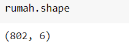
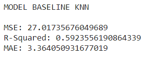
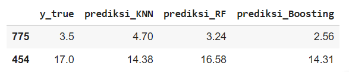
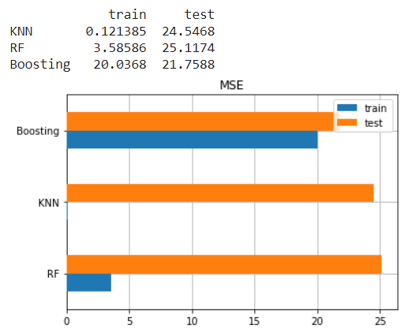

# Laporan Proyek Machine Learning - Panji Arlin Saputra

## Domain Proyek
Domain proyek yang dipilih dalam proyek machine learning ini adalah mengenai perniagaan yang secara khusus mengenai sektor properti dengan judul proyek "Prediksi Harga Rumah di Jakarta Selatan".

* Latar Belakang
    
    Kebutuhan pokok manusia terdiri dari sandang (pakaian), pangan (makanan), papan (tempat tinggal). Ketiga hal tersebut penting untuk kelangsungan hidup manusia.
    Tempat tinggal/rumah tidak hanya berfungsi sebagai tempat bertahan atau melindungi diri, namun juga sebagai tempat berkumpul bersama keluarga tercinta. 

    Berdasarkan berita yang dihimpun dari [KOMPAS](https://www.kompas.com/properti/read/2021/07/15/163000121/selama-pandemi-penjualan-rumah-secara-online-meningkat-368-persen), penjualan rumah secara online meningkat 36,8% selama masa pandemi. Maka dari itu diperlukan sebuah sistem yang dapat membantu manusia dalam menentukan harga jual dan beli rumah. Salah satunya pada proyek ini, dimana akan dibuat sebuah model machine learning untuk memprediksi harga rumah tepatnya di Kota Jakarta Selatan. Dengan adanya model machine learning ini diharapkan dapat memudahkan para pelaku dibidang penjualan properti dalam memprediksi harga rumah di Kota Jakarta Selatan.

## Business Understanding

### Problem Statements
Berangkat dari latar belakang diatas, berikut ini merupakan rincian masalah yang dapat diselesaikan pada proyek ini :
* Bagaimana cara melakukan pra-pemrosesan data penjualan rumah agar dapat digunakan untuk membuat model yang baik?
* Bagaimana cara membuat model machine learning untuk memprediksi harga rumah?

### Goals
Berikut adalah tujuan dari dibuatnya proyek ini:
* Melakukan pra-pemrosesan data harga rumah yang baik agar dapat digunakan dalam membuat model.
* Membuat sebuah model yang dapat memprediksi harga rumah di Jakarta Selatan.

### Solution statements
Solusi yang dapat dilakukan untuk memenuhi tujuan dari proyek ini diantaranya:

* Untuk pra-pemrosesan data dapat dilakukan beberapa teknik, diantaranya:
    * Menghapus data pencilan pada data dengan metode IQR :
        * **IQR = Q3 - Q1** 
        dimana,
            * IQR : *Inter Quartile Range*
            * Q1 : kuartil pertama
            * Q3 : kuartil ketiga
    * Melakukan pembagian dataset menjadi dua bagian dengan rasio 80% untuk data latih dan 20% untuk data uji.
    * Melakukan standardisasi data pada semua fitur data.
    * Poin pra-pemrosesan data akan dibahas lebih lanjut pada bagian Data Preparation.

* Membuat model machine learning regresi dengan penggunaan beberapa algoritma, diantaranya:
    * K-Nearest Neighbor (KNN). 
        KNN bekerja dengan membandingkan jarak satu sampel ke sampel pelatihan lain dengan memilih sejumlah k-tetangga terdekat.
    * Random Forest. 
        Random Forest pada dasarnya adalah versi bagging dari algoritma decision tree.
    * Boosting. 
        Proyek ini akan menggunakan metode adaptive boosting. Salah satu metode adaptive boosting yang terkenal adalah AdaBoost.

* Membuat model baseline yang akan dikembangkan dengan pengaturan hyperparameter otomatis dengan `HalvingGridSearchCV`. `HalvingGridSearchCV` merupakan metode pencarian parameter yang optimal dengan _Successive Halving_ untuk menemukan hyperparameter terbaik.
    * Cara kerja _Successive Halving_ : 
        * _Successive Halving_ seperti kompetisi atau turnamen di antara semua kombinasi hyperparameter.
        * Pada iterasi pertama, metode ini bekerja dengan melatih kombinasi hyperparameter hiper pada subset pengamatan (data pelatihan). Kemudian pada iterasi berikutnya hanya dipilih kombinasi hyperparameter yang memiliki performansi baik pada iterasi pertama dan akan dilatih dalam jumlah observasi yang banyak untuk bersaing. Sehingga proses seleksi ini diulangi pada setiap iterasi hingga terpilih kombinasi hyperparameter terbaik pada iterasi terakhir.

## Data Understanding
Informasi Dataset:

| Jenis | Keterangan |
| ----- | ----- |
| Sumber | [Kaggle Dataset: Daftar Harga Rumah](https://www.kaggle.com/wisnuanggara/daftar-harga-rumah) |
| Jenis dan Ukuran Berkas | XLSX (118 kB) |

Pada berkas yang diunduh yakni `HARGA RUMAH JAKSEL.xlsx` berisi data penjualan rumah sebanyak 1001 baris. Terdapat 5 buah data numerik dan 2 buah data kategori. Untuk penjelasan mengenai variabel-variable pada data dapat dilihat pada poin-poin berikut:
1. `HARGA` : merupakan data harga rumah dalam mata uang Rupiah (Rp).
2. `LT` : merupakan data luas tanah dalam satuan m2.
3. `LB` : merupakan data luas bangunan dalam satuan m2.
4. `JKT` : merupakan data jumlah kamar tidur.
5. `JKM` : merupakan data jumlah kamar mandi.
6. `GRS` : merupakan data garasi.
7. `KOTA` : merupakan data nama kota dimana rumah tersebut berada.

* Beberapa tahapan yang dilakukan sebelum memvisualisasikan data:
    * Menghapus variabel `KOTA` karena semua datanya memiliki nilai yang sama. 
        
    * Mengecek jumlah nilai kosong pada data. 
        
    * Mengubah satuan harga menjadi miliar Rupiah. 
        

Berikut ini visualisasi pada setiap data:
* Analisis univariat
    * Fitur kategoris: menampilkan jumlah dan persentase sampel pada setiap nilai pada variabel `GRS` 
         
        Dapat disimpulkan bahwa lebih dari 77% sampel memiliki garasi.

    * Fitur Numerik: menampilkan histogram masing-masing fiturnya 
         
        Berdasarkan pemgamatan histogram di atas, khususnya histogram untuk variabel `HARGA` yang merupakan fitur target (label) pada data. Dari histogram `HARGA`, diperoleh beberapa informasi, antara lain:
        * Peningkatan harga rumah sebanding dengan penurunan jumlah sampel.
        * Distribusi harga miring ke kanan (*right-skewed*). Hal ini akan berimplikasi pada model.

* Analisis multivariat
    * Fitur kategoris: mengetahui pengaruh fitur kategori terhadap harga 
         
        Pada fitur `GRS`, nilai tertinggi yaitu 'ADA'. Rentangnya harga pada semua nilai berada disekitar angka 11 hingga 13. Sehingga dapat disimpulkan bahwa fitur `GRS` memiliki sedikit pengaruh atau dampak yang kecil terhadap rata-rata harga.

    * Fitur numerik:
        * Mengamati hubungan antara fitur numerik 
             
            Dapat dilihat berdasarkan korelasi semua variabel terhadap variabel target (`HARGA`), dari pola sebaran data (titik-titik) pada gambar di atas, pola data grafik `LT` dan `LB` memiliki korelasi positif. Hal ini ditandai dengan meningkatnya variabel pada sumbu y saat terjadi peningkatan variabel pada sumbu x.

        * Mengobservasi korelasi antara fitur numerik dengan fitur target 
             
            Berdasarkan metrik korelasi diatas yang mengacu pada fitur `HARGA`, dapat disimpulkan bahwa fitur `HARGA` berkorelasi tinggi terhadap fitur `LT` dan `LB`. Sementara itu, fitur `JKT` dan `JKM` memiliki korelasi yang tidak  terlalu kecil terhadap fitur `HARGA` sehingga variabel tersebut tidak perlu dihapus.

## Data Preparation
Berikut adalah tahapan-tahapan dalam melakukan persiapan data:
* Menghapus data pencilan pada data dengan metode IQR (*Inter Quartile Range*).

    * **IQR = Q3 - Q1** 
        Dimana, seperempat dari data berada di bawah kuartil pertama (Q1), setengah dari data berada di bawah kuartil kedua (Q2), dan tiga perempat dari data berada di kuartil ketiga (Q3).

        * Berikut ini merupakan visualisai data pencilan pada variabel `LT` : 
            

        * Jumlah data setelah mengaplikasikan metode IQR : 
            

* *Encoding* Fitur Kategori 
    Hal ini dilakukan untuk mengubah nilai kategoris menjadi nilai numerik karena nilai numerik diperlukan dalam proses pelatihan model. Proyek ini menggunakan teknik `one-hot-encoding` pada variabel `GRS` dengan cara mengubah nilai 'ADA' menjadi 0 dan nilai 'TIDAK ADA' menjadi 1.
    

* Reduksi Dimensi dengan metode PCA (*Principal Component Analysis*) 
    PCA merupakan teknik mengurangi jumlah fitur dengan tetap mempertahankan informasi pada data yang dilakukan dengan cara mengubah fitur asli menjadi kumpulan fitur lain yang tidak berkorelasi linier. 
    * Mengamati korelasi antara fitur `LT` dan `LB`. 
        

    * Dari output dibawah, lebih dari 85% informasi pada fitur `LT` dan `LB` terdapat pada komponen pertama. Sedangkan sisanya, terdapat pada komponen kedua. 
         
    
    * Setelah mengaplikasikan PCA pada fitur `LT` dan `LB`. 
         
    

* Melakukan pembagian dataset menjadi dua bagian dengan rasio 80% untuk data latih dan 20% untuk data uji dengan menggunakan metode `train_test_split` dari pustaka `sklearn`. Hal ini dilakukan agar tetap mempertahankan sebagian data yang ada untuk menguji seberapa baik generalisasi model terhadap data baru.

* Melakukan standardisasi data pada semua fitur data menggunakan metode `StandardScaler` yang mana metode ini melakukan proses standarisasi fitur dengan mengurangkan nilai rata-rata kemudian membagi rata-rata tersebut dengan nilai standar deviasi untuk menggeser distribusi sehingga menghasilkan distribusi dengan standar deviasi sama dengan 1 dan rata-rata sama dengan 0. Standarisasi fitur dilakukan agar semua fitur numerik berada dalam skala data yang sama juga membuat komputasi dari pembuatan model dapat berjalan lebih cepat.

## Modeling

* Dalam membuat model machine learning regresi, proyek ini menerapkan penggunaan beberapa algoritma yaitu:
    * K-Nearest Neighbor (KNN). 
        KNN bekerja dengan membandingkan jarak satu sampel ke sampel pelatihan lain dengan memilih sejumlah k-tetangga terdekat.
    * Random Forest. 
        Random Forest pada dasarnya adalah versi bagging dari algoritma decision tree. Dalam teknik bagging, sejumlah model dilatih dengan teknik sampling dengan penggantian. Model decision tree masing-masing memiliki hyperparameter yang berbeda dan dilatih pada beberapa bagian data yang berbeda juga.
    * Boosting. 
        Proyek ini akan menggunakan metode adaptive boosting. Salah satu metode adaptive boosting yang terkenal adalah AdaBoost. Pada teknik boosting, model dilatih secara berurutan atau dalam proses yang iteratif. 

* Dalam pembuatan model terdapat dua hal yang akan dilakukan, yakni tahap pembuatan model baseline dan pembuatan model yang dikembangkan.
    * Model baseline 
        Pada tahap ini, dilakukan proses pembuatan model dasar dengan menggunakan modul `scikit-learn` tanpa menggunakan parameter tambahan. Lalu melakukan prediksi kepada data ujinya dengan hasil pengukuran terhadap data uji berupa metrik evaluasi pada beberapa algoritma berikut ini:
        * K-Nearest Neighbor (KNN) 
            

        * Random Forest 
            

        * Boosting 
            
    
    * Model yang dikembangkan 
        Kemudian setelah melihat kinerja model baseline, agar dapat bekerja lebih optimal lagi maka digunakan sebuah fungsi untuk mencari hyperparameter yang optimal dengan `HalvingGridSearchCV`. Setelah ditemukan yang optimal, kemudian hyperparameter tersebut diterapkan ke model baseline. Berikut ini hasil pencarian parameter terbaik:
        * K-Nearest Neighbor (KNN) 
            

        * Random Forest 
            

        * Boosting 
            
    
* Melakukan prediksi dengan data uji 
     
    Berdasarkan hasil prediksi yang dilakukan terhadap data uji pada proyek ini, dapat disimpulkan bahwa model yang menggunakan algoritma Random Forest menghasilkan hasil prediksi yang lebih baik dibandingkan model yang menggunakan algoritma K-Nearest Neighbors dan Boosting.

## Evaluation
Pada proyek ini, model yang dibuat merupakan kasus regresi dan menggunakan metrik evaluasi MSE (*mean squared error*), R2 (*r-squared*), dan MAE (*mean absolute error*). Pada gambar dibawah ini ditampilkan kembali hasil pengukuran model yang dikembangkan dengan metrik evaluasi MSE, R2, dan MAE.

Berikut ini adalah hasil pengukuran metrik evaluasi pada model yang telah dibuat sebelumnya:
* MSE (*mean squared error*) 
    

* R2 (*r-squared*) 
    

* MAE (*mean absolute error*) 
    

Berikut ini adalah penjelasan mengenai metrik evaluasi yang digunakan pada proyek ini:
* MSE (*mean squared error*) 
    * Dalam menghitung MSE, perlu mencari nilai beda antara nilai prediksi model dan nilai sebenarnya lalu dikuadratkan dan dijumlahkan total seluruhnya kemudian dibagi dengan banyak sampel pada dataset. Berikut ini adalah rumusnya: 
     
    Dimana N adalah jumlah sampel yang diuji.

    * MSE memiliki kelebihan yaitu sederhana dalam perhitungan sedangkan kelemahannya adalah akurasi hasil prediksi sangat kecil karena tidak memperhatikan apakah hasil prediksi lebih besar atau lebih kecil dibandingkan kenyataannya.

    * Untuk menerapkan MSE kedalam kode, kita perlu mengimpor pustaka berikut ini : `from sklearn.metrics import mean_squared_error`.

* R2 (*r-squared*) 
    * Koefisien determinasi (*R-squared*) merupakan proporsi varian dalam variabel dependen yang dapat diprediksi dari variabel independen. Ini adalah statistik yang menunjukkan persentase perubahan yang terjadi pada variabel terikat yang dapat dijelaskan oleh perubahan variabel bebas. Berikut ini adalah rumusnya: 
     

    * Ini adalah statistik yang menunjukkan persentase perubahan yang terjadi pada variabel terikat yang dapat dijelaskan oleh perubahan variabel bebas. Kelemahan dalam penggunaan R2 adalah bias terhadap jumlah variabel independen yang dimasukkan ke dalam model.

    * Untuk menerapkan koefisien determinasi kedalam kode, kita perlu mengimpor pustaka berikut ini : `from sklearn.metrics import r2_score`.

* MAE (*mean absolute error*) 
    * MAE hanya sedikit berbeda dari MSE. Dalam menghitung MAE, kita cari nilai beda antara nilai prediksi model dan nilai sebenarnya lalu menerapkan nilai absolut pada nilai beda tersebut, dan kemudian dibagi dengan banyak sampel pada dataset. Berikut ini adalah rumusnya: 
     

    * Kelebihan MAE adalah keunggulannya secara langsung menutupi kerugian MSE. Karena kita mencari nilai absolut, semua kesalahan akan dibobotkan pada skala linier yang sama. Sedangkan kekurangannya adalah jika kita benar-benar peduli dengan prediksi outlier model, maka MAE tidak akan seefektif itu.

    * Untuk menerapkan MAE kedalam kode, kita perlu mengimpor pustaka berikut ini : `from sklearn.metrics import mean_absolute_error`.

## **_Referensi_**
* Dokumentasi Scikit-learn: https://scikit-learn.org/stable/modules/classes.html
* Kaggle Dataset Daftar Harga Rumah: https://www.kaggle.com/wisnuanggara/daftar-harga-rumah
* Berita KOMPAS: https://www.kompas.com/properti/read/2021/07/15/163000121/selama-pandemi-penjualan-rumah-secara-online-meningkat-368-persen